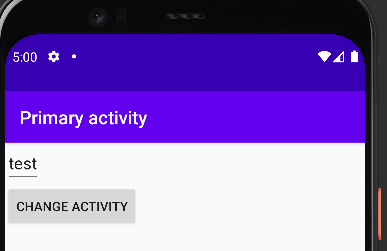
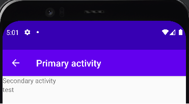

# Rapport

JAg har skapat en app med 2 aktiviteter. Huvudaktveteten kan man skriva in
och skicka vidare en text, till det sekundära aktiviteten.
Den sekundära aktiviteten visar texten.

I kommande kodexempel så ser vi ett intent från mainaktivity. Den hämtar texten från edittext-fältet och lägger det som en
extra parameter till intenten. Detta så att den går att läsa i nästa ativitet. 
Sist startar jag en ny aktivitet och skikar med den intent som jag har skapat. 
```
Intent sendIntent = new Intent(this, SecondaryActivity.class);
EditText et = findViewById(R.id.textInput);
String getText = et.getText().toString();
sendIntent.putExtra("inputText", getText);
startActivity(sendIntent);
```

Här ser vi hur en aktivitet tar emot en intent. Detta med en getIntent(); Och sedan kan jag hämta de extra parametrarna
som har skickats med i intenten. Jag skiver sedan ut den text som skickades med i en textView.
```
setContentView(R.layout.activity_secondary);
recieve = (TextView) findViewById(R.id.recieveText);
Intent getIntent = getIntent();
String getMessage = getIntent.getStringExtra(MainActivity.message);
recieve.setText(getMessage);
```


Först bilden visar layouten för en första aktiviteten. Där kan du skriva in en text(Där det står test). 
Andra blden visar layouten för den andra aktiviteten. Där visas den text som skrevs in i den primära aktiviteten.

